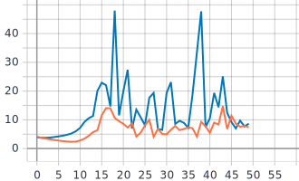

Лабораторная работа 1.  
====

### Информация о цели лабараторной работы.
В данной лабораторной работе нужно было подготовить работоспособное окружение для решения задачи классификации изображений из набора данных Food-101 с использованием нейронных сетей глубокого обучения. Набора данных Food-101 включает 101000 изображений. Для обучения двумерной сверточной нейронной сети использовалось 50 эпох, каждая из которых разделена на части(батч) включающее изначально 256 изображений, в дальнейшем в качестве эксперимента, это значение изменялось.

# 2. С использованием примера[1] обучить представленную реализацию нейронной сети для решения задачи классификации изображений Food-101
* **Описание архитектуры:**   
 
* Размерность входного изображения (224x224x3): 
```
inputs = tf.keras.Input(shape=(RESIZE_TO, RESIZE_TO, 3))
```

* Слой 2D свертки. Параметры: 8 filtres, kernel_size=3 (матрица ядра = 3x3)
```
x = tf.keras.layers.Conv2D(filters=8, kernel_size=3)(inputs) //размер выходного тензора 222х222х8
```

* Операция подвыборки. Параметры по умолчанию: pool_size = 2х2, strides = 2.
```
x = tf.keras.layers.MaxPool2D()(x) //размер выходного тензора 111х111х8
```

* Преобразование многомерного тензора в одномерный. 
 ```
 x = tf.keras.layers.Flatten()(x) // размер выходного тензора 111x111x8 = 98568
 ```
 
 * Полносвязный Dense слой с 20 выходами и функцией активации softmax, которая определяет к какой категории и с какой вероятностью относится поданное на вход изображение.
```
outputs = tf.keras.layers.Dense(NUM_CLASSES, activation=tf.keras.activations.softmax)(x)
```

 ### Графики обучения для нейронной сети с одним сверточным слоем:
 
Синяя линия - на валидации
Оранжевая линия - на обучении

 ***График метрики точности:*** 


 ***График функции потерь:*** 
 


### Анализ результатов:

На графиках значение функции потерь на валидационном наборе данных выше, чем значение функции потерь на обучающем наборе данных, а значит наблюдается переобучение, что вызвано большим батчсайзом. 

# 3.Создать и обучить сверточную нейронную сеть произвольной архитектуры с количеством сверточных слоев >3
* **Описание структуры** 
* Добавленны 3 сверточных слоя Conv2D с изменнеными параметрами filters = 8 для первого слоя, и увеличение на 4 на последующих слоях, и kernel_size = 3 для первого слоя, и увеличение на 1 на последующих слоях.
* Добавленны 3 слоя подвыборки MaxPool2D. Параметры по умолчанию: pool_size = 2х2, strides = 2.

 ```
  x = tf.keras.layers.Conv2D(filters=8, kernel_size=3)(inputs)
  x = tf.keras.layers.MaxPool2D()(x)
  x = tf.keras.layers.Conv2D(filters=12, kernel_size=4)(x)
  x = tf.keras.layers.MaxPool2D()(x)
  x = tf.keras.layers.Conv2D(filters=16, kernel_size=5)(x)
  x = tf.keras.layers.MaxPool2D()(x)
  x = tf.keras.layers.Conv2D(filters=20, kernel_size=6)(x)
  x = tf.keras.layers.MaxPool2D()(x)
  x = tf.keras.layers.Flatten()(x)
  outputs = tf.keras.layers.Dense(NUM_CLASSES, activation=tf.keras.activations.softmax)(x)
  ```


 ### Графики обучения для нейронной сети с несколькими сверточными слоями:
 
Синяя линия - на валидации
Оранжевая линия - на обучении

 ***Батч сайз 256*** 
 ***График метрики точности:*** 


 ***График функции потерь:*** 
 


 ### Экспериментальное изменение батчсайза для нейронной сети с несколькими сверточными слоями:
 
|         Батчсайз         |                      График метрики точности                                    |                 График функции потерь                                            |
| ------------------------ |:-------------------------------------------------------------------------------:| --------------------------------------------------------------------------------:|
|            64            |                   |                                    |
|            128           |                  |                                   |
|            512           |                  |                                   |

### Анализ результатов:

На графиках значение функции потерь на валидационном наборе данных выше, чем значение функции потерь на обучающем наборе данных, а значит наблюдается переобучение. А также, из графика метрики точности видно, что значение точности у сверточной нейронной сети с одним слоем выше, чем у нейронной сети с 4 слоями. Однако видны все те же проблемы. Причинами этого могут быть, как и выше описанные предположения, так и внесенные изменения. 

